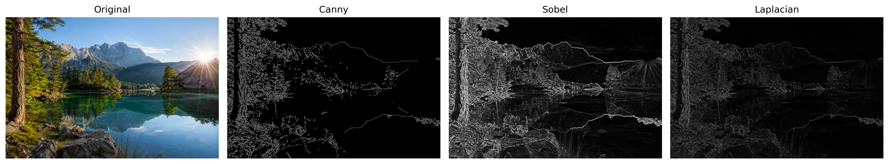

# Kết quả thực nghiệm

## 1. Mục tiêu thực nghiệm

Thực nghiệm này nhằm so sánh ba thuật toán phát hiện biên gồm
Canny, Sobel và Laplacian. Các thuật toán sử dụng cùng một ảnh đầu
vào và các bước tiền xử lý giống nhau để bảo đảm tính công bằng.

## 2. Ảnh đầu vào

- Tên ảnh: `sample.png`
- Định dạng màu: BGR
- Kích thước ảnh: 1536 × 1024 pixel
- Đường dẫn: `data/input/normal/sample.png`

## 3. Quy trình xử lý

Quy trình thực nghiệm gồm các bước:

1. Đọc ảnh màu BGR.
2. Chuyển ảnh màu sang ảnh xám.
3. Sử dụng Gaussian Blur để giảm nhiễu.
4. Áp dụng thuật toán phát hiện biên.
5. Hiển thị và so sánh kết quả.

## 4. Thông số thực nghiệm

| Thuật toán | Thông số |
|---|---|
| Canny | Ngưỡng thấp = 100, ngưỡng cao = 200 |
| Sobel | Kích thước kernel = 3 |
| Laplacian | Kích thước kernel = 3 |
| Gaussian Blur | Kích thước kernel = (5, 5), sigma = 1.0 |

## 5. Kết quả so sánh

Ảnh kết quả được sắp xếp theo thứ tự:

`Ảnh gốc | Canny | Sobel | Laplacian`

## 6. Nhận xét kết quả

| Thuật toán | Nhận xét |
|---|---|
| Canny | Tạo đường biên mảnh, rõ ràng và hạn chế nhiễu tốt. |
| Sobel | Phát hiện sự thay đổi theo chiều ngang và dọc, nhưng đường biên thường dày hơn. |
| Laplacian | Phát hiện được nhiều chi tiết nhỏ nhưng nhạy với nhiễu hơn. |

## 7. Kết luận

Canny tạo ra đường biên rõ ràng và cân bằng nhất trên ảnh thử
nghiệm. Sobel phù hợp để phát hiện sự thay đổi cường độ theo các
hướng, trong khi Laplacian phát hiện được nhiều chi tiết nhỏ nhưng
cũng dễ xuất hiện nhiễu. Vì vậy, Canny là thuật toán phù hợp nhất
để phát hiện đường biên rõ ràng trong thực nghiệm này.
