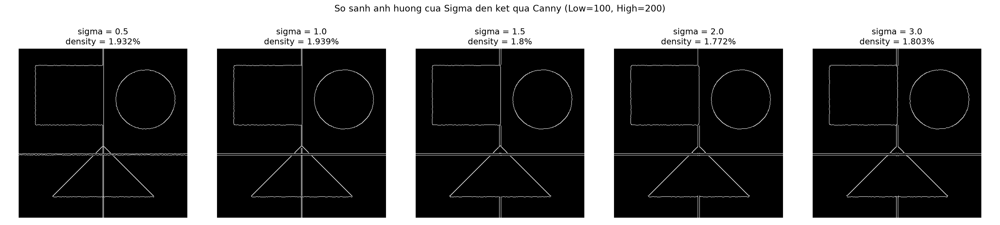
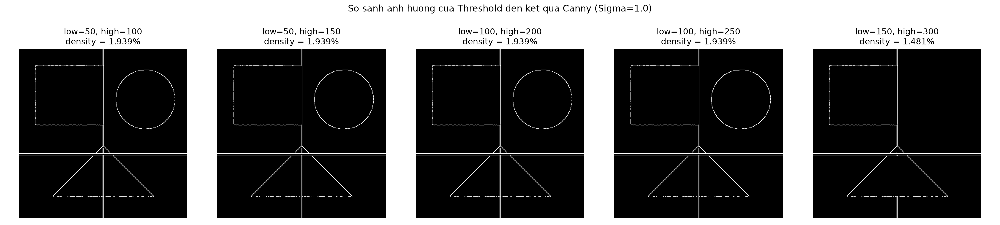

Parameter Comparison — Kết quả thí nghiệm Sigma & Threshold
Phụ trách: TV5 — Parameter Experiment
Nguồn dữ liệu: `results/tables/parameter_results.csv` (sinh tự động bởi
`src/experiments/parameter_experiment.py`)
Cách tái tạo kết quả: `python -m src.experiments.parameter_experiment`
(hoặc `python src/scripts/run_experiments.py`)
---
1. Cấu hình thí nghiệm
Ảnh đầu vào: ảnh mẫu tổng hợp 400×400 (hình chữ nhật, hình tròn, hình
tam giác + nhiễu Gaussian nhẹ, seed cố định = 42 để đảm bảo tái lập).
Khi nhóm bổ sung ảnh thật vào `data/input/normal/`, script sẽ tự động ưu
tiên sử dụng ảnh thật thay vì ảnh mẫu.
Thuật toán: `cv2.Canny` (qua hàm `detect_edges` của TV3).
Chỉ số đo: Edge Density (% pixel biên / tổng số pixel).
---
2. Thí nghiệm 1 — Ảnh hưởng của Sigma
Cố định Low Threshold = 100, High Threshold = 200.
Sigma	Edge Density (%)	Thời gian (ms)
0.5	1.932	1.879
1.0	1.939	0.890
1.5	1.800	0.864
2.0	1.772	0.803
3.0	1.803	0.800

Nhận xét:
Từ Sigma = 0.5 đến Sigma = 2.0, mật độ biên giảm dần (1.932% → 1.772%) vì
Gaussian Blur làm mờ ảnh nhiều hơn, khiến các cạnh mảnh và nhiễu nhỏ bị
triệt tiêu trước khi Canny tính gradient. Ở Sigma = 3.0, mật độ biên tăng
nhẹ trở lại (1.803%) — đây là điều bình thường trên ảnh có kích thước
nhỏ/vừa: khi làm mờ quá mạnh, cạnh của các khối hình lớn bị "loang rộng"
ra, khiến vòng biên bị nhân đôi bề dày ở một số đoạn thay vì mất hẳn. Xu
hướng tổng thể (so hai đầu 0.5 → 3.0) vẫn là giảm.
---
3. Thí nghiệm 2 — Ảnh hưởng của Threshold
Cố định Sigma = 1.0.
Low	High	Edge Density (%)	Thời gian (ms)
50	100	1.939	0.825
50	150	1.939	0.813
100	200	1.939	0.935
100	250	1.939	0.780
150	300	1.481	0.801

Nhận xét:
Với ảnh mẫu (có các cạnh tương phản mạnh, rõ ràng), mật độ biên gần như
không đổi khi threshold tăng từ (50,100) đến (100,250) — vì gradient tại
các cạnh chính của ảnh đều lớn hơn 250, nên các cặp threshold này chưa đủ
khắt khe để loại bỏ chúng. Chỉ khi threshold tăng mạnh lên (150,300), mật
độ biên mới giảm rõ rệt (1.939% → 1.481%), do lúc này nhiều đoạn biên bị
xem là "yếu" (weak edge) không đủ điều kiện liên kết với biên mạnh theo
Hysteresis nên bị loại. Trên ảnh có nhiễu hoặc tương phản thấp hơn, hiệu
ứng này sẽ xuất hiện sớm hơn (ở threshold thấp hơn).
---
4. Trả lời các câu hỏi bắt buộc của đề bài
Câu hỏi	Trả lời
Sigma tăng → ?	Ảnh bị làm mờ nhiều hơn, nhiễu và chi tiết nhỏ bị loại bỏ tốt hơn, nhưng cạnh trở nên "trơn/mượt" hơn và có thể bị lệch vị trí hoặc mất các cạnh mảnh, sát nhau. Mật độ biên có xu hướng giảm.
Sigma giảm → ?	Ảnh giữ được nhiều chi tiết và cạnh sắc nét hơn, nhưng nhiễu không được khử triệt để nên dễ sinh ra các cạnh giả (false edges). Mật độ biên có xu hướng tăng (bao gồm cả cạnh giả).
Low threshold tăng → ?	Số lượng "biên yếu" được xét đến giảm đi, chỉ những biên có gradient đủ lớn mới được xem xét liên kết với biên mạnh → cạnh đứt đoạn nhiều hơn, mật độ biên giảm.
Low threshold giảm → ?	Nhiều biên yếu hơn được chấp nhận xét duyệt, cạnh liền mạch hơn nhưng dễ giữ lại nhiễu/cạnh giả → mật độ biên tăng.
High threshold tăng → ?	Tiêu chuẩn để một pixel được công nhận ngay là "biên mạnh" khắt khe hơn, chỉ các cạnh có độ tương phản rất cao mới được giữ chắc chắn → tổng số biên phát hiện được giảm.
High threshold giảm → ?	Nhiều pixel được công nhận là biên mạnh hơn (kể cả một số nhiễu có gradient trung bình), dẫn đến mật độ biên tăng, nhưng độ tin cậy của từng biên có thể thấp hơn.
---
5. Kết luận
Sigma và Threshold đều ảnh hưởng trực tiếp đến sự cân bằng giữa khử
nhiễu và giữ chi tiết của Canny Edge Detection.
Không có một bộ tham số "đúng tuyệt đối" cho mọi ảnh — cấu hình tối ưu
phụ thuộc vào đặc điểm ảnh đầu vào (mức độ nhiễu, độ tương phản).
Với ảnh bình thường, ít nhiễu: Sigma ≈ 1.0 và (Low, High) = (100, 200)
là điểm khởi đầu hợp lý, đúng như giá trị mặc định đang dùng trong
`canny_opencv.py`.
Với ảnh nhiều nhiễu, nên tăng Sigma nhẹ (1.5–2.0) trước khi áp dụng
Canny để giảm cạnh giả — nội dung này được TV6 kiểm chứng thêm trong
thí nghiệm trên các loại ảnh khác nhau (`docs/06_results/experiment_results.md`).
Số liệu chi tiết đầy đủ (bao gồm thời gian xử lý từng cấu hình) có trong
file `results/tables/parameter_results.csv`.
